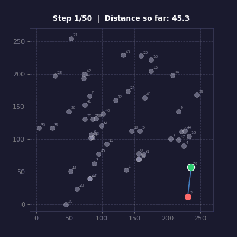
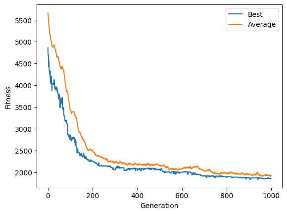
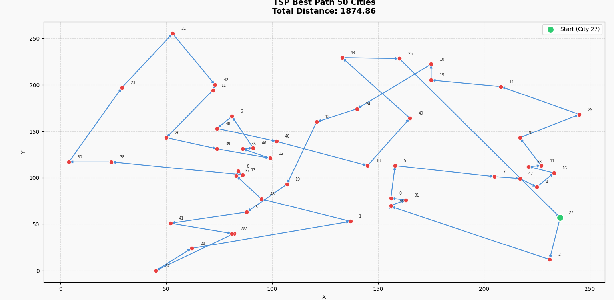

# Solving Travelling Salesman Problem with Genetic Algorithm



Implementing **GA** to get a good enough solution of **TSP**.

---

## Problem

> What is the shortest possible route that visits each city exactly once and returns to the origin city?

This implementation uses **50 cities with randomly generated coordinates**.

---

## Representation

Each individual in the population represents a path.

Example chromosome:

```
[12, 3, 41, 7, 0, 9, ...]
```

Each number represents a **city index**, and the order defines the travel path.

---


### Initialization

* Generate random permutations of city indices.

### Fitness

Route distance is calculated using Euclidean distance.

Fitness function used:

```
fitness = 1 / distance^4
```

This strongly favors shorter routes.

### Selection

Roulette wheel selection.(coulve used tournament or rank but wanted to try out roulette, and it worked great)

### Crossover

A custom crossover is used to ensure:

* no duplicate cities
* valid tours
in all fairness it's just a hybrid OX-PMX crossover preserving absolute positions and relative order.

### Mutation

Random city swaps.

---

## Parameters

```
Cities: 50
Population size: 500
Survivors per generation: 40%
Generations: 500
Mutation: random city swap
```

---

## Results

The algorithm tracks the **best route distance** and **average distance** per generation.

### Convergence



### Sample Best Route Found



Over generations, the population gradually improves and shorter routes emerge.

---

## Run

Install dependency:

```
pip install matplotlib
```

Run the program:

```
python main.py
```
